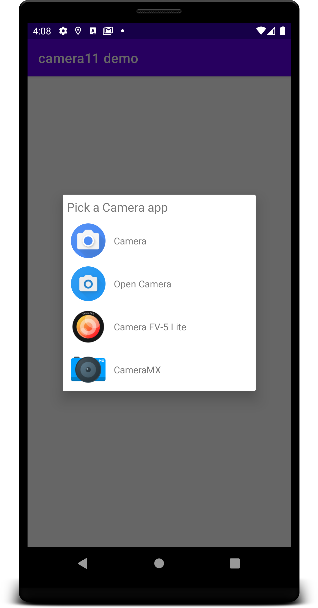

## Camera11
Camera intent for Android 11

[](https://jitpack.io/#frankkienl/Camera11)

Since Android 11, it's no longer possible to fire a image-capture Intent, and expect an IntentChooser to pop up automatically.  
For reasons, Google decided that it's better to always launch the pre-installed camera app, instead of let the user have a choice.
To make it harder for developers to give this choice back to the user, they've crippled the IntentResolver, so it doesn't return any results when querying.

**This library gives that choice back to the user.**  
We just work around the whole IntentResolver, and read the AndroidManifest.xml's directly, to find out which IntentFilters there are.

Don't worry about older Android versions, on older versions it just uses the old way.

# How to use:

Add jitpack.io in your root build.gradle at the end of repositories:
```
	allprojects {
		repositories {
			...
			maven { url 'https://jitpack.io' }
		}
	}
```  
Add the dependency
```
	dependencies {
	        implementation 'com.github.frankkienl:Camera11:1.0'
	}
```
Call Camera11.openCamera from an Activity
```
//in an Activity
Camera11.openCamera(activity, MediaStore.ACTION_IMAGE_CAPTURE, outputUri, requestCode);
```



